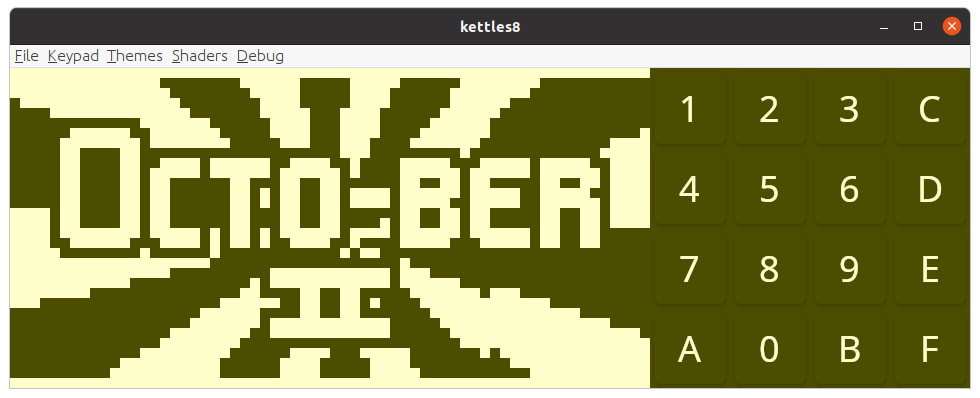

# kettles8

A chip8 emulator written in Kotlin with Jetpack Compose Multiplatform.

The goal of this project was to learn the basics of Kotlin and emulator development. It inadvertently became an opportunity to learn how to work with LLMs as well, which I used extensively to implement audiovisual features like Jetpack Compose layouts, sound engineering for the patented chip8 monotone beep, and shaders in agsl and sksl. 

|  |
|:-------------------------------------------:|
|                  *Desktop*                  |

|  |
|:-----------------------------------------------:|
|           *Desktop with CRT effects*            |

|  |
|:-------------------------------------------:|
|                  *Android*                  |

|  |
|:-----------------------------------------------:|
|  *Android (Tiramisu and up) with CRT effects*   |

# References

* http://devernay.free.fr/hacks/chip8/C8TECH10.HTM
* https://austinmorlan.com/posts/chip8_emulator/

# Test ROMs
* https://github.com/Timendus/chip8-test-suite
* https://johnearnest.github.io/chip8Archive/